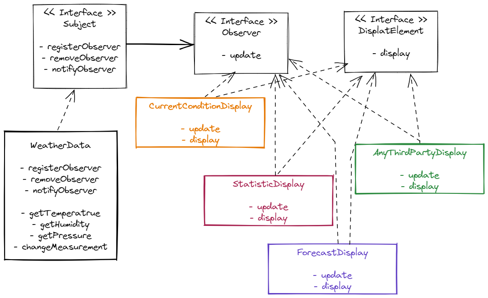

# design-patterns

## Observer Pattern

### Diagram


### Source Code
```
📦observer
 ┣ 📂subject
 ┃ ┣ 📜Subject.java
 ┃ ┗ 📜WeatherData.java
 ┣ 📜CurrentConditionDisplay.java
 ┣ 📜DisplayElement.java
 ┣ 📜Observer.java
 ┣ 📜StatisticsDisplay.java
 ┗ 📜WeatherStation.java
 ```